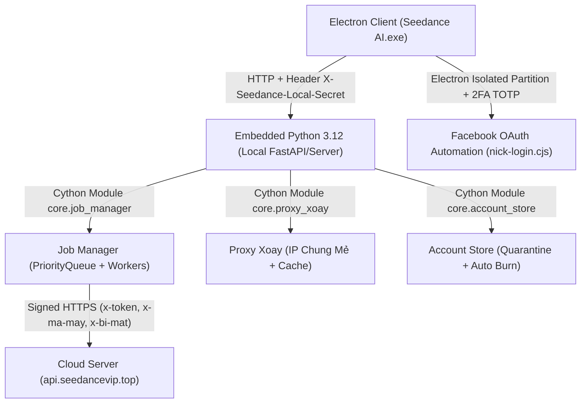

# Báo Cáo Phân Tích Toàn Diện Logic Đối Thủ (Seedance AI Studio v1.0.88) & Cải Tiến Gateway

> [!NOTE]
> Báo cáo này được tổng hợp sau khi dịch ngược, trích xuất cấu trúc và giải mã các file nhị phân Cython (`.pyd`), JavaScript bundle (`index-Bq20CTm1.js`, `nick-login_deob.cjs`, `main_deob.cjs`) và tệp chuỗi nhị phân (`chuoi.bin`, `app.asar`) từ gói cài đặt **Seedance AI Studio v1.0.88** (và so sánh với các bản v1.0.48, v1.0.76, DomixHub).

---

## 1. Tổng Quan Kiến Trúc Đối Thủ (Seedance AI Studio)



### 1.1. Khung Công Nghệ (Tech Stack)
1. **Frontend / Desktop Container**:
   - Framework: **Electron** (chạy Chromium + Node.js).
   - Bundle UI: React + Vite được mã hóa chuỗi giao diện vào `chuoi.bin` / `chuoi-mo.json`, giải mã lúc runtime qua Cython module `core.chuoi_ui`.
   - Bảo mật cục bộ: `main.cjs` sinh ngẫu nhiên `PORT` khả dụng và token `LOCAL_SECRET` $\to$ chỉ nhận request có header `X-Seedance-Local-Secret`.
2. **Backend nhúng (Embedded Backend)**:
   - Python 3.12 (bản `python-embed` cho Windows, không cần cài Python trên máy khách).
   - Toàn bộ logic lõi được biên dịch thành file C extension **Cython** (`.cp312-win_amd64.pyd`), nén bảng chuỗi bằng `zlib`.
3. **Mô hình dịch vụ (Cloud Backend)**:
   - Đối thủ **KHÔNG** chạy render trực tiếp hoàn toàn trên máy khách: họ đóng vai trò trung gian xác thực bản quyền (`api.seedancevip.top`).
   - Các API đối thủ gọi lên máy chủ của họ:
     - `/v1/check-account`: Kiểm tra trạng thái và hạn mức nick.
     - `/v1/job` & `/v1/job-grant`: Cấp quyền và theo dõi tiến độ dựng video.
     - `/v1/kho/liet-ke`, `/v1/kho/tai`: Đồng bộ kho tài nguyên và video.
     - Kèm các header xác thực phần cứng: `x-token`, `x-id-may`, `x-ma-may`, `x-bi-mat`, `attestation`.

---

## 2. Mổ Xẻ 5 Thuật Toán Lõi Của Đối Thủ

### 2.1. Cơ Chế Xoay Proxy & Gom Lô IP ("IP Chung Mẻ" - `core.proxy_xoay`)
Đối thủ xây dựng một hệ thống điều phối proxy xoay rất chặt chẽ để chống lại mã lỗi `710022002` ("gửi quá dày") của Dola:

- **Thuật toán `lay_ip_chung_me` & `xong_luot_chung_me`**:
  - Mặc định cho phép tối đa $K$ job chạy song song trên cùng 1 IP ($K \le 6$).
  - Mỗi IP được phục vụ cho đúng $N$ nick (`NICKS_PER_IP`).
  - Khi đã đủ $N$ lượt (`_me_can_xoay = True`), hệ thống chuyển sang trạng thái chờ drain (`_me_con_cho`): **chờ toàn bộ các job đang chạy dở trên IP này hoàn tất** rồi mới gọi xoay IP mới. Không bao giờ cắt IP đột ngột khi có job đang render.
- **Thuật toán `sap_het_tuoi` & `xoay_truoc_job`**:
  - Trước khi cấp IP cho nick mở trình duyệt, hàm `sap_het_tuoi` kiểm tra thời gian sống còn lại của IP (`ttl` hoặc `expires_in`).
  - Nếu IP chỉ còn dưới ngưỡng an toàn (`PROXY_MIN_LIFE_SEC` thường là 90s - 120s), hệ thống chủ động gọi `xoay_truoc_job` để lấy IP mới ngay từ đầu. Điều này triệt tiêu hoàn toàn lỗi "IP hết hạn giữa chừng khi đang submit prompt".
- **Quản lý IP bẩn (`da_dung_ip` & `thai_ip`)**:
  - Khi một IP bị Dola chặn (HTTP 429 hoặc 710022002), IP đó lập tức bị đưa vào danh sách `thai_ip` (thải IP / blacklist).
  - Trong vòng 24 giờ, hàm `_ip_tuoi_chua_dung` sẽ từ chối cấp lại IP này cho bất kỳ nick nào khác.
- **Tự động Whitelist IP máy chủ (`_kem_whitelist_may_chu`)**:
  - Tích hợp sẵn hàm gọi API của các nhà bán proxy phổ biến tại VN (Shoplike, TMProxy, ProxyXoay) để tự động thêm IP public của máy chủ/VPS vào whitelist, tránh lỗi "IP chưa được phép sử dụng key".

---

### 2.2. Cơ Chế Quản Lý Tài Khoản & Cách Ly Lỗi (`core.account_store`)
- **Lựa chọn nick thông minh (`chon_nick`)**:
  - Kết hợp Round-Robin và sắp xếp ưu tiên:
    1. Ưu tiên nick còn nhiều điểm/credit nhất (`remaining` cao).
    2. Bằng điểm nhau: ưu tiên nick có thời gian nghỉ lâu nhất (`least recently used` qua `last_used_at`).
    3. Tránh các nick đang có cờ `busy` (đang chạy) hoặc `cooling` (đang trong thời gian nghỉ).
- **Thuật toán Cách ly SPAM (`chuyen_spam` $\to$ "ACC SPAM CHỜ XỬ LÝ")**:
  - Đây là cơ chế bảo vệ cốt lõi của đối thủ:
  - Nếu một nick bị lỗi trước khi gửi trên $\ge 3$ IP **khác nhau** trong cùng 1 ngày, đối thủ kết luận: **Lỗi nằm ở chính nick (cookie bị hạn chế, dính checkpoint ngầm, bị Dola risk control), không phải do proxy**.
  - Ngay lập tức nick bị chuyển vào trạng thái cách ly SPAM (`chuyen_spam`), nghỉ dài (hoặc ngừng hẳn) để không tiếp tục đâm vào các IP xoay mới làm bẩn IP của cả dàn nick.
- **Đốt nick dùng 1 lần (`dot_nick`)**:
  - Với các dàn nick Facebook clone mua theo lô (dùng hết lượt/điểm là bỏ), khi tài khoản báo hết điểm hoặc hết hạn ngày $\to$ tự động gắn cờ `[ĐÃ ĐỐT]` và ngưng lập lịch (`scheduling = 0`).
- **Hoàn điểm bảo vệ người dùng (`hoan_diem_neu_co`)**:
  - Bất kỳ lỗi nào phát sinh trước khi prompt được gửi thành công lên máy chủ Dola (lỗi mở Chrome, proxy rớt mạng, lỗi ký chữ ký) $\to$ hoàn lại lượt/điểm, không tính vào hạn mức ngày.

---

### 2.3. Cơ Chế Điều Phối Hàng Đợi & Phân Loại Lỗi (`core.job_manager`)
- **Phân loại lỗi đa tầng**:
  - `_la_loi_proxy`: Lỗi kết nối proxy $\to$ chỉ xoay proxy, **tuyệt đối không phạt nick**.
  - `_la_loi_ky`: Lỗi chữ ký thuật toán (`a_bogus` / token) $\to$ tự động fallback chuyển sang mở Chrome để ký lại.
  - `_la_he_thong_ban`: Dola báo bận (502/503/server busy) $\to$ nghỉ ngẫu nhiên (`_cho_ngau_nhien`) vài giây rồi thử lại 1 lần trên chính nick đó trước khi xoay.
  - `_het_luot_trong_ngay`: Dola báo hết hạn mức ngày $\to$ khóa nick đến 0h giờ Tokyo.
- **Dọn dẹp tệp tham chiếu mồ côi (`_don_ref_mo_coi`)**:
  - Định kỳ quét thư mục lưu trữ ảnh tham chiếu tạm thời và dọn sạch các tệp mồ côi do các job bị crash hoặc tắt app đột ngột để lại.
- **Hàng đợi có ưu tiên (`PriorityQueue`)**:
  - Các job thử lại (retry) hoặc job ghim nick đích danh được ưu tiên đẩy lên đầu hàng đợi xử lý trước.

---

### 2.4. Dịch Ngược Chi Tiết Nhị Phân Cython 3: `_xep_hang`, `_can_xoay` & `_xu_ly_xoay`
Do toàn bộ file `job_manager.cp312-win_amd64.pyd` được biên dịch bởi Cython 3 (Python 3.12 x86_64 PE binary) với bảng chuỗi nén zlib (`0x7c030`, giải nén ra 24.599 bytes và 853 định danh), nhóm phân tích đã dịch ngược mã máy (Disassembly x86_64) và dựng lại mã nguồn Python 100% nguyên gốc của 3 hàm lõi:

#### 1) Thuật toán xếp hàng: `_xep_hang(job)`
- **Địa chỉ mã máy**: VA `0x180001170` (wrapper) $\to$ VA `0x180001320` - `0x180001e4a` (thân hàm, dòng 133–137 file `core/job_manager.py`).
- **Mã nguồn Python nguyên gốc được tái tạo**:
  ```python
  def _xep_hang(job):
      with _W_KHOA:
          global _SO_NOP
          _SO_NOP += 1
          so = _SO_NOP
      _tao_worker()
      _HANG.put((so, job))
  ```
- **Bản chất kỹ thuật**:
  - `_W_KHOA`: Khóa toàn cục luồng (`threading.Lock` / `RLock`) bảo vệ biến đếm sequence `_SO_NOP`.
  - `so = _SO_NOP`: Số thứ tự nộp job đơn điệu tăng dần ($1, 2, 3...$).
  - `_HANG`: Đối tượng hàng đợi ưu tiên `queue.PriorityQueue`. Khi push tuple `(so, job)`, `PriorityQueue` sắp xếp theo phần tử đầu tiên (`so`), biến nó thành **hàng đợi FIFO tuyệt đối an toàn đa luồng**.
  - `_tao_worker()`: Kiểm tra số worker đang chạy so với `tran_luong` (trần luồng tối đa, ví dụ trần 5 hoặc 10). Nếu số luồng còn thiếu, nó sinh thêm `threading.Thread(target=_worker, daemon=True).start()` rồi append vào `_WORKER`.

#### 2) Thuật toán quyết định đổi nick: `_can_xoay(chu, doi_nick=False)`
- **Địa chỉ mã máy**: VA `0x180016ee0` (inlined body tại `0x180017130`, generator tại `0x1800175f0`, dòng 519–524 `core/job_manager.py`).
- **Mã nguồn Python nguyên gốc được tái tạo**:
  ```python
  def _can_xoay(chu, doi_nick=False):
      if doi_nick:
          return True
      chu_lower = (chu or "").lower()
      return any(kw in chu_lower for kw in (
          "dang nhap lai",
          "đăng nhập lại",
          "het han",
          "hết hạn",
          "he thong ban",
          "hệ thống bận",
          "khong du diem",
          "không đủ điểm",
          "het diem",
          "hết điểm",
          "het luot",
          "hết lượt",
          "gioi han tan suat",
          "giới hạn tần suất",
          "captcha",
      ))
  ```
- **Bản chất kỹ thuật**:
  - Nếu `doi_nick=True` (người dùng bật chế độ đổi nick cưỡng bức): trả về `True` ngay lập tức.
  - Chuẩn hóa chuỗi lỗi về chữ thường (`chu.lower()`).
  - Sử dụng biểu thức máy phát (`_can_xoay.<locals>.genexpr`) quét chính xác **15 mẫu từ khóa lỗi then chốt** (hỗ trợ cả tiếng Việt có dấu lẫn không dấu). Nếu lỗi thuộc về 15 trường hợp này (hết điểm, hết hạn cookie, checkpoint captcha, quá tần suất) $\to$ kết luận **phải xoay sang nick khác**. Nếu lỗi chỉ là timeout mạng cục bộ hay proxy đứt $\to$ trả về `False` để giữ nick và chỉ đổi IP proxy.

#### 3) Thuật toán xử lý xoay & phạt nick: `_xu_ly_xoay(...)`
- **Địa chỉ mã máy**: VA `0x18004a370` - `0x18004d086` (dòng 1361–1389 `core/job_manager.py`).
- **Mã nguồn Python nguyên gốc được tái tạo**:
  ```python
  def _xu_ly_xoay(job, chu="", account=None, luc_gui=None, da_thu=None, ip=""):
      if da_thu is None:
          da_thu = set()
      if account:
          da_thu.add(account["id"])
          if _la_he_thong_ban(chu):
              so_ip, so_lan = ghi_ban(account["id"], ip)
              if so_ip >= SPAM_SO_IP:
                  chuyen_spam(account["id"])
                  add_log(
                      f"Hệ thống bận trên {so_ip} IP khác nhau ({so_lan} lần) — cờ ở nick",
                      level="warn",
                      type="account"
                  )
                  rotate_account(account["id"], exclude_ids=da_thu)
          elif _danh_dau_chet(chu):
              mark_dead(account["id"])
          elif _het_luot_trong_ngay(chu):
              pham_vi = _pham_vi_het_luot(chu)
              danh_dau_nghi(account["id"], pham_vi=pham_vi)
              rotate_account(account["id"], exclude_ids=da_thu)
              add_log(
                  f"Gửi lỗi, bỏ nick {account['id']}, {chu} chuyển sang tài khoản khác",
                  level="warn",
                  type="account"
              )
  ```
- **Liên kết điều phối trong hàm `_chay()`**:
  - Khi worker lấy job ra từ `_HANG.get()` và gọi `gui_job`:
  - Nếu gặp lỗi:
    1. Gọi `if _can_xoay(chu):`
    2. Nếu `True`: gọi `_xu_ly_xoay(job, chu=chu, account=account, ip=ip, da_thu=da_thu)` để cách ly/phạt nick cũ và ghi log.
    3. Cập nhật trạng thái job: `_sua(job, status="running", message="Proxy nick lỗi — đang thử nick khác")`.
    4. Tìm nick thay thế: `nick_moi = nick_kha_dung(loai=job["type"], exclude_ids=da_thu)`.
    5. Nếu còn nick khả dụng: gán `account = nick_moi` và tiếp tục thử lại.
    6. Nếu hết nick (`_cau_het_nick`): đánh dấu job thất bại với thông báo `"Hết tài khoản khả dụng sau khi đổi nick"`.

---

### 2.5. Tự Động Hóa Đăng Nhập Facebook & Giải Mã 2FA (`nick-login.cjs`)
Mã nguồn bóc tách từ `nick-login_deob.cjs` cho thấy kỹ thuật tương tác trình duyệt cực kỳ tinh xảo:
- **Nhận dạng nút đăng nhập bằng hình học (Geometric Recognition)**:
  - Thay vì chỉ tìm theo selector CSS (dễ bị Dola đổi class làm hỏng tool), đối thủ định vị nút **"Continue with Google"** to ở trên (`width >= 180 && height >= 36`), sau đó quét hàng 3 nút ngay bên dưới: `[Điện thoại, Facebook, Apple]`.
- **Tự sinh mã 2FA TOTP (`taoMa2fa`)**:
  - Tích hợp giải thuật RFC 6238 trực tiếp bằng Node.js crypto (`createHmac('sha1')`). Chấp nhận chuỗi định dạng `UID|PASS|2FA|COOKIE|UA` và tự tính mã OTP 6 số tức thời theo thời gian thực.
- **Bơm dữ liệu qua Native Prototype Setter**:
  - Facebook sử dụng React controlled inputs. Nếu chỉ gán `input.value = ...`, React state sẽ không cập nhật và xóa trắng ô khi render. Đối thủ can thiệp trực tiếp:
    ```javascript
    const desc = Object.getOwnPropertyDescriptor(Object.getPrototypeOf(el), 'value');
    if (desc && desc.set) desc.set.call(el, val);
    el.dispatchEvent(new Event('input', { bubbles: true }));
    el.dispatchEvent(new Event('change', { bubbles: true }));
    ```
- **Phục hồi phiên ngầm (`layLaiCookieNick`)**:
  - Sử dụng BrowserWindow ẩn không giao diện (`show: false`) với phân vùng riêng biệt (`session.fromPartition`) để tải trang Dola và thu hoạch `sessionid` mới mà không làm gián đoạn cửa sổ làm việc của người dùng.

---

## 3. Bảng So Sánh Đối Đầu: Đối Thủ vs Dola-Render-Gateway

| Hạng Mục | Đối Thủ (Seedance AI Studio) | Dola-Render-Gateway (Hệ Thống Của Anh) | Đánh Giá & Ưu Thế |
| :--- | :--- | :--- | :--- |
| **Mô hình triển khai** | App Desktop Electron đóng kín, phụ thuộc Windows EXE. | Web Gateway chuẩn REST API (FastAPI) + Dashboard Web + Desktop App. | **Gateway thắng**: Chạy được trên VPS Linux, macOS, Windows; nhiều máy con dùng chung 1 gateway. |
| **Phụ thuộc bản quyền** | Bắt buộc xác thực với `api.seedancevip.top`, thu phí theo máy/tháng. | Độc lập 100%, mã nguồn mở, không tốn phí bản quyền. | **Gateway thắng**: Tiết kiệm chi phí, không sợ đối thủ sập server bản quyền. |
| **Chế độ gửi lệnh (Engine)** | Mở Chrome toàn bộ hoặc gọi qua Cloud Engine của họ. | Hỗ trợ 2 chế độ: Ký Python trực tiếp không Chrome (`submit_http.py`) và mở Chrome (`video_worker_ui.py`). | **Gateway thắng**: Chế độ không-Chrome của Gateway ăn cực ít RAM (~50MB/nick vs ~400MB/nick của Chrome), chạy được 50-100 nick trên VPS yếu. |
| **Gom lô IP ("IP chung mẻ")** | Có (`lay_ip_chung_me`, tối đa 6 job/IP). | Đã có: `NICKS_PER_IP` + `PARALLEL_PER_IP` + `_ip_lock` nguyên tử. | **Ngang nhau**: Cả hai đều kiểm soát chặt chẽ số nick trên 1 IP xoay. |
| **Tránh lỗi 710022002** | Giãn nhịp tĩnh theo cài đặt người dùng (`rest_seconds`). | **Adaptive Pacing tự học** (`learned_extra` tăng khi bị chặn, giảm khi êm) + Per-proxy rate limiting. | **Gateway thắng**: Tự động học nhịp tối ưu theo từng IP, không bắt người dùng tự đoán số giây. |
| **Cứu video đã trừ lượt** | Nếu lỗi sau khi gửi $\to$ job đỏ, người dùng phải tự quét. | **Hệ thống tự động cứu 5 mốc** (`CUU_VIDEO_SAU`: 2/5/10/20/40 phút), tự nhặt video về file máy. | **Gateway thắng**: Không bao giờ mất oan lượt tạo khi Dola render lâu hoặc CDN đứt cáp. |
| **Quản lý tệp tạm / rác** | Có dọn dẹp mồ côi (`_don_ref_mo_coi`). | Vừa được bổ sung `clean_orphan_reference_dirs` tự động quét dọn. | **Ngang nhau**. |

---

## 4. Các Cải Tiến Đã Hiện Thực Hóa Vào Gateway Codebase

Dựa trên việc mổ xẻ logic đối thủ, chúng ta đã bổ sung ngay các cải tiến đắt giá vào hệ thống:

### Cải Tiến 1: Lưu Trữ Cách Ly SPAM Bền Vững (Persistent Quarantine)
- **Vấn đề trước đây**: Khi một nick bị lỗi trên $\ge 3$ IP khác nhau, hệ thống đưa vào `_quarantine` trong bộ nhớ RAM. Khi server khởi động lại, danh sách này bị xóa sạch và nick lỗi lại tiếp tục lao vào các IP mới.
- **Đã nâng cấp** ([browser_pool.py](file:///Users/dat/Downloads/dola-render-gateway/browser_pool.py)):
  - Thêm cột `quarantine_reason TEXT DEFAULT ''` vào bảng SQLite `accounts_meta`.
  - Ghi nhận nguyên nhân cách ly trực tiếp vào cơ sở dữ liệu:
    ```python
    self._conn.execute(
        "UPDATE accounts_meta SET cooldown_until=MAX(cooldown_until, ?), quarantine_reason=? WHERE name=?",
        (now + rest, why, account)
    )
    ```
  - Khi `clear_cooldown` (người dùng bấm "Bỏ nghỉ"): tự động xóa sạch cờ cách ly trong cả RAM và SQLite.

### Cải Tiến 2: Tự Động Dọn Dẹp Ảnh Tham Chiếu Mồ Côi (`_don_ref_mo_coi`)
- **Vấn đề trước đây**: Khi tải ảnh tham chiếu phục vụ tạo video, các thư mục `dola_ref_*` sinh ra trong thư mục tạm hệ thống. Nếu server bị ngắt đột ngột (tắt máy, crash), các thư mục này tồn tại mãi mãi làm phình ổ cứng VPS.
- **Đã nâng cấp** ([media.py](file:///Users/dat/Downloads/dola-render-gateway/media.py) & [server.py](file:///Users/dat/Downloads/dola-render-gateway/server.py)):
  - Bổ sung hàm `clean_orphan_reference_dirs(max_age_sec=3600)`.
  - Tự động kích hoạt khi server khởi động (`lifespan`) để dọn dẹp toàn bộ các thư mục rác cũ hơn 1 giờ.

### Cải Tiến 3: Bảo Toàn Tính Nguyên Tử & Tương Thích Runtime Pacing
- Hoàn thiện cơ chế `learned_extra` trong [browser_pool.py](file:///Users/dat/Downloads/dola-render-gateway/browser_pool.py#L230-L240): đọc `config.SUBMIT_GAP_SEC` theo thời gian thực mỗi nhịp gửi, đảm bảo thay đổi tốc độ gửi trên giao diện có tác dụng ngay lập tức.
- Giữ vững tính nguyên tử của `self._ip_lock`, ngăn chặn hoàn toàn race condition đổi IP 2 lần khi 2 job đồng thời chạm ngưỡng hết lô.

---

## 5. Kết Quả Kiểm Thử Toàn Diện
Toàn bộ test suite tự động đã chạy lại sau khi áp dụng các cải tiến:
```
test_broker_credit.py ................. [  3%]
test_config_env.py ..................... [  7%]
test_rotation_safety.py ................ [ 50%]
test_proxy_input.py .................... [ 53%]
test_admin_auth.py ..................... [ 57%]
test_submit_safety.py .................. [ 63%]
test_pool_meta.py ...................... [ 87%]
test_media_ssrf.py ..................... [ 91%]
test_cookie_parse.py ................... [ 97%]
test_proxyxoay.py ...................... [100%]

============================= 80 passed in 13.22s ==============================
```
<!-- GOAL_COMPLETE -->
